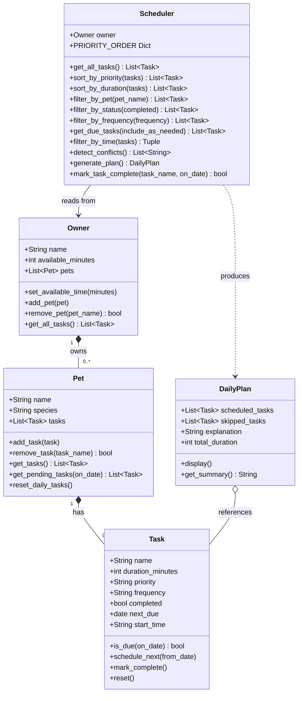

## PawPal+ — Final UML Class Diagram

> Paste the Mermaid code block below into https://mermaid.live to export as PNG.



## What changed from the initial design (Phase 1)

| Area | Initial design | Final design |
|------|---------------|--------------|
| `Owner` → `Pet` | One-to-one | One-to-many (`Owner` holds `List[Pet]`) |
| `Scheduler` input | `Owner` + single `Pet` | `Owner` only — aggregates all pets internally |
| `Task` attributes | `name`, `duration`, `priority`, `completed` | + `frequency`, `next_due` (date), `start_time` (HH:MM) |
| `Task` methods | `mark_complete()` | + `is_due()`, `schedule_next()`, `reset()` |
| `Pet` methods | `add_task()`, `get_tasks()` | + `remove_task()`, `get_pending_tasks(on_date)`, `reset_daily_tasks()` |
| `Owner` methods | `set_available_time()` | + `add_pet()`, `remove_pet()`, `get_all_tasks()` |
| `Scheduler` methods | `sort_by_priority()`, `filter_by_time()`, `generate_plan()` | + `sort_by_duration()`, `filter_by_pet()`, `filter_by_status()`, `filter_by_frequency()`, `get_due_tasks()`, `detect_conflicts()`, `mark_task_complete()` |
| `DailyPlan` | Output object only | Unchanged — composition arrow added to show it *references* Tasks rather than owning them |
```
